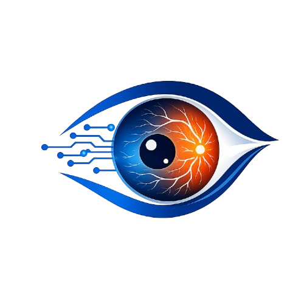
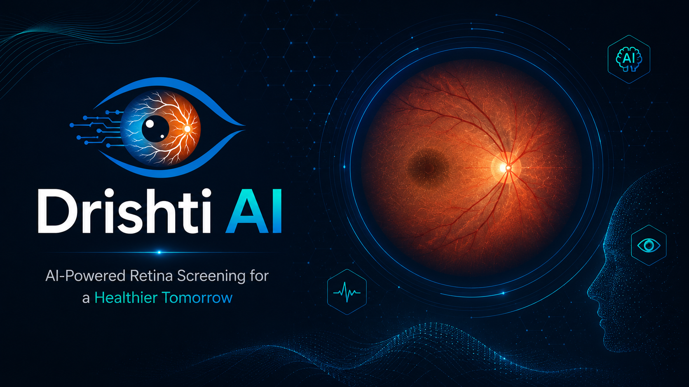

<div align="center">



# DrishtiAI — दृष्टि AI

### AI-Powered Diabetic Retinopathy Screening

[](https://react.dev)
[](https://python.org)
[](https://tensorflow.org)
[](https://nodejs.org)
[](https://mongodb.com)
[](https://groq.com)

<br/>

> **India has 77 million diabetic patients but only 1 ophthalmologist per 70,000 people.**
> DrishtiAI brings AI-powered retina screening to everyone — free, fast, and private.

<br/>



</div>

---

## 🌟 What is DrishtiAI?

DrishtiAI is a full-stack AI medical screening platform that detects **Diabetic Retinopathy (DR)** from retinal fundus photographs using deep learning. Early detection can prevent **95% of blindness cases** in diabetic patients.

The platform provides:
- **Instant AI diagnosis** in under 5 seconds
- **Explainable AI** via Grad-CAM heatmaps
- **Personalized recommendations** powered by Groq's Llama 3.3
- **Patient history tracking** with trend analysis
- **PDF reports** for sharing with doctors

---

## ✨ Features

| Feature | Description |
|---------|-------------|
| 🧠 **AI Detection** | EfficientNetB3 CNN classifies retina into No DR, Low DR, High DR |
| 🔍 **Grad-CAM XAI** | Heatmap visualization showing which retinal regions the AI focused on |
| ⚡ **Instant Results** | Complete screening with confidence scores in under 5 seconds |
| 🤖 **Gyaan AI** | Personalized recommendations via Groq Llama 3.3 based on patient profile |
| 📊 **Dashboard** | Patient-specific scan history with severity trend charts |
| 📄 **PDF Reports** | Downloadable styled reports with Grad-CAM images |
| 🏥 **Doctor Locator** | Find nearby ophthalmologists via OpenStreetMap |
| 🔐 **Auth System** | JWT-based login/register with diabetic profile |
| 🌙 **Dark UI** | Premium dark medical-grade interface |

---

## 🏗️ Architecture

```
User uploads retina image
        ↓
React Frontend (Vite + Tailwind)
        ↓
Node.js Backend (Express) ←→ MongoDB Atlas
        ↓                         ↑
Flask Model API              Scan History
        ↓
EfficientNetB3 CNN
        ↓
Grad-CAM Generation
        ↓
Groq AI (Llama 3.3)
        ↓
Result + Recommendations
```

---

## 🛠️ Tech Stack

### AI / ML
- **Model**: EfficientNetB3 with Transfer Learning (2-phase)
- **Dataset**: APTOS 2019 Blindness Detection (3,662 images)
- **Framework**: TensorFlow / Keras
- **XAI**: Grad-CAM (Gradient-weighted Class Activation Mapping)
- **Preprocessing**: Ben Graham preprocessing + CLAHE

### Backend
- **API Server**: Node.js + Express
- **Model API**: Python + Flask
- **Database**: MongoDB Atlas
- **Auth**: JWT + bcryptjs
- **AI Recommendations**: Groq SDK (Llama 3.3 70B)

### Frontend
- **Framework**: React 18 + Vite
- **Styling**: Tailwind CSS + custom inline styles
- **Maps**: Leaflet.js + OpenStreetMap
- **PDF**: jsPDF
- **Charts**: Custom SVG bar charts

---

## 📊 Model Performance

| Metric | Value |
|--------|-------|
| Overall Accuracy | **88%** |
| No DR Accuracy | **97%** |
| Weighted F1 Score | **0.876** |
| Architecture | EfficientNetB3 |
| Training Strategy | Transfer Learning (2-phase) |
| Classes | No DR, Low DR, High DR |
| Scan Time | **< 5 seconds** |

### Class Mapping
```python
# APTOS 5-class → DrishtiAI 3-class
0 → 0  (No DR)
1 → 1  (Low DR - Mild)
2 → 1  (Low DR - Moderate)
3 → 2  (High DR - Severe)
4 → 2  (High DR - Proliferative)
```

---

## 🚀 Getting Started

### Prerequisites
- Node.js 18+
- Python 3.10+
- MongoDB Atlas account
- Groq API key

### 1. Clone the repository
```bash
git clone https://github.com/sohanbarat-dev/drishti-ai.git
cd drishti-ai
```

### 2. Setup Backend
```bash
cd backend
npm install
```

Create `backend/.env`:
```env
PORT=5000
MONGODB_URI=your_mongodb_uri
JWT_SECRET=your_jwt_secret
FLASK_API_URL=http://localhost:5001
GROQ_API_KEY=your_groq_api_key
```

```bash
node server.js
```

### 3. Setup Model API
```bash
cd model
pip install -r requirements.txt
python app.py
```

> **Note**: You need `drishti_model.keras` in the `model/` directory.
> Download the trained model from [Releases](https://github.com/sohanbarat-dev/drishti-ai/releases) or train your own using `train.py`.

### 4. Setup Frontend
```bash
cd frontend
npm install
```

Create `frontend/.env`:
```env
VITE_API_URL=http://localhost:5000
```

```bash
npm run dev
```

### 5. Open in browser
```
http://localhost:5173
```

---

## 📁 Project Structure

```
drishti-ai/
├── model/                      # Python CNN + Flask API
│   ├── app.py                  # Flask REST API
│   ├── train.py                # Model training script
│   ├── gradcam.py              # Grad-CAM visualization
│   ├── test_run.py             # Model testing
│   └── data/                   # Training data (gitignored)
│
├── backend/                    # Node.js Express server
│   ├── src/
│   │   ├── models/
│   │   │   ├── User.js         # User schema (with diabetic profile)
│   │   │   └── Scan.js         # Scan history schema
│   │   ├── controllers/
│   │   │   ├── authController.js
│   │   │   └── scanController.js
│   │   ├── routes/
│   │   │   ├── authRoutes.js
│   │   │   └── scanRoutes.js
│   │   ├── middleware/
│   │   │   └── authMiddleware.js
│   │   └── services/
│   │       └── groqService.js  # Gyaan AI recommendations
│   └── server.js
│
└── frontend/                   # React + Vite
    └── src/
        ├── pages/
        │   ├── Login.jsx        # Glassmorphism login
        │   ├── Register.jsx     # 2-step registration
        │   ├── Home.jsx         # Landing page
        │   ├── Scan.jsx         # Image upload + analysis
        │   ├── Result.jsx       # Results + Grad-CAM + PDF
        │   ├── Dashboard.jsx    # Patient history + trends
        │   ├── DoctorLocator.jsx # Find nearby doctors
        │   └── About.jsx        # Project info
        ├── components/
        │   └── Navbar.jsx
        └── services/
            └── api.js
```

---

## 🎯 How It Works

```
1. Patient uploads fundus retina photograph
        ↓
2. Ben Graham preprocessing enhances blood vessels
        ↓
3. EfficientNetB3 classifies into 3 severity levels
        ↓
4. Grad-CAM generates heatmap of AI focus regions
        ↓
5. Groq Llama 3.3 generates personalized recommendations
        ↓
6. Result saved to MongoDB under patient account
        ↓
7. PDF report generated with images + recommendations
```

---

## 🖼️ Screenshots

### Login Page
> Glassmorphism design with DrishtiAI banner

### Scan Page
> Drag & drop retina image upload

### Result Page
> Diagnosis + Grad-CAM heatmap + Gyaan AI recommendations + PDF download

### Dashboard
> Patient history + severity trend chart

### Doctor Locator
> OpenStreetMap-powered eye specialist finder

---

## 🧠 About Grad-CAM

Grad-CAM (Gradient-weighted Class Activation Mapping) makes the AI **explainable**:

- After EfficientNetB3 makes a prediction, gradients flow back through the last convolutional layer
- A heatmap is generated showing which retinal regions most influenced the classification
- **Red/warm regions** = areas the AI focused on most
- **Blue/cool regions** = areas the AI mostly ignored

This is critical for medical AI — clinicians need to understand **why** the model flagged something, not just **what** it flagged.

---

## ⚠️ Disclaimer

DrishtiAI is developed for **educational and research purposes only**.

- It is **NOT** a certified medical device
- It should **NOT** be used as a substitute for professional medical diagnosis
- Always consult a qualified ophthalmologist for diagnosis and treatment
- Results are AI predictions and may not be 100% accurate

---

## 👨‍💻 Developer

**Sohan Barat**
- B.Tech CSE — KIIT University (2023–27)
- CGPA: 9.14
- GitHub: [@sohanbarat-dev](https://github.com/sohanbarat-dev)

---

## 📄 License

This project is licensed under the MIT License — see the [LICENSE](LICENSE) file for details.

---

<div align="center">

**Built with ❤️ for 77 million diabetic patients in India**

*EfficientNetB3 + Transfer Learning + Groq Llama 3.3 + React + Node.js + MongoDB*

</div>
